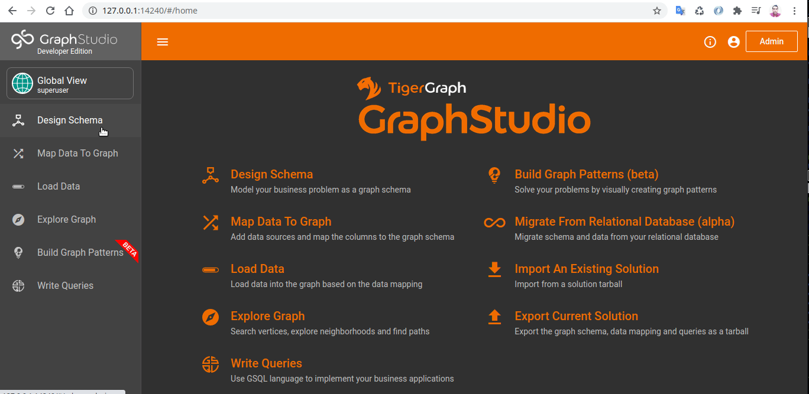

## Getting Started
Requirements are :

* TigerGraph Server instance Installed.
* Import  Covid Sample Solution  ( Youtube Demo to be prepared ) Located in  "Dash-Bootstrap-TigerGraph-Covid19\src\Data_Covid_TigerGraph_data".
* Import  Covid Sample GSQL Queries  ( Youtube Demo to be prepared ) Located in "Dash-Bootstrap-TigerGraph-Covid19\src\gsqlQueries".
* Graphistry API Account ( see config-sample.py ).




**Setup Virtual ENV**

```console
$ python3 -m virtualenv -p python3 .

```

**Activate  VENV**


```console
$ source bin/activate

```


**Install requirements VIA PyPi**

```console
$ pip install -r requirements.txt

```

Note: For HTML with dash use [**Dash HTML Components**](https://dash.plotly.com/dash-html-components)


### Launch Sample Dash Bootstrap Theme  (Testing)
 
Change Directory to /Dash-Bootstrap-Theme

```console
$ python index.py

```

### Launch Covid-19 Dash  
 
Change Directory to /Dash-Bootstrap-TigerGraph-Covid19

```console
$ python index.py

```


## Get Help 
Join [Tiger Graph Official Community](https://discord.gg/uSDZ5x) and
 [Futurist Academy Discord Server](https://discord.gg/vyc5CrG) for help


## Resources:

* [Dash-Plotly Website](https://plotly.com/dash/)
* [Dash Bootstrap](https://dash-bootstrap-components.opensource.faculty.ai/)
* [Dash Boostrap GitHub](https://github.com/facultyai/dash-bootstrap-components)
* [Dash Bootsrap Themes](https://bootswatch.com/lux/)
* [Graphistry Library](https://graphistry.com)
